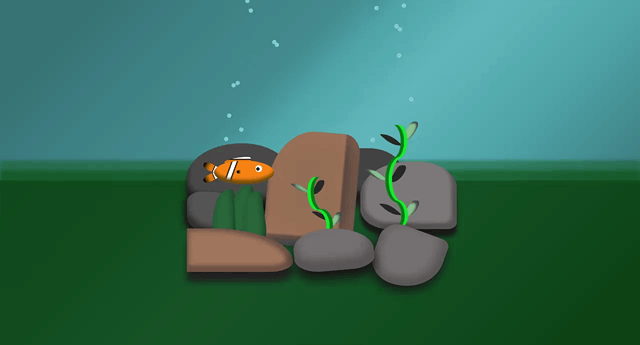

# CSS-fish 🐠

> Fish animation using pure CSS 🙌

### See the <a href='https://dnt-knw.github.io/CSS-fish' target='_blank' title='Click to open the project'>Demo</a> 👁

## Description 📖

- 📜 Swimming underwater striped fish 🐠
- 📜 The background contains
    - Rocks 🗿
    - Algae 🌿
    - Deep sea 🌊
